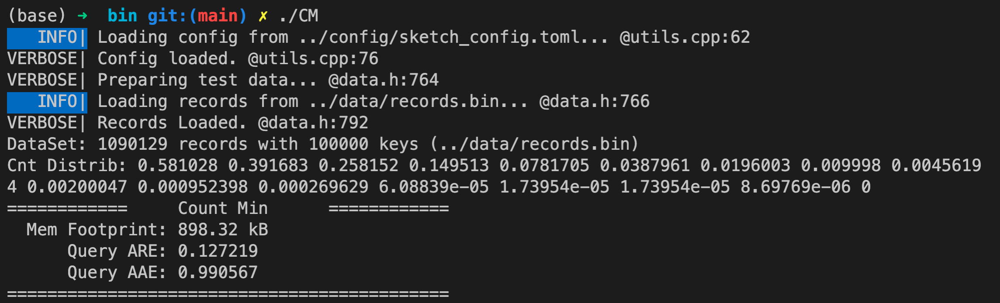
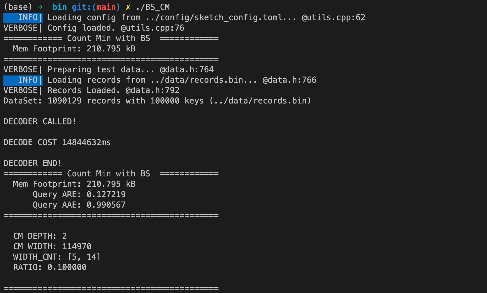

# BitSense

This repo contains our simulator and prototype code of BitSense. Specifically,

- `simulator/` contains a trace-driven simulator we built to integrate various sketching algorithms with BitSense.
- `testbed/` contains BitSense data plane prototype written in $\mathrm{P4}_{16}$ (see [here](https://p4.org/p4-spec/docs/P4-16-v1.0.0-spec.html)) that can be compiled and loaded onto Tofino switches.

We are willing to hear your feedback. Please let us know if you'd like to contribute to BitSense applications. If you have further questions and suggestions, don't hesitate to contact us at dr_abc@pku.edu.cn or huangqun@pku.edu.cn.

## Part I: Simulator Programs

### Files
Simulator programs include the following directories.
- `bin/` contains executable files after compilation
- `build/` contains intermediate objects generated by CMake and Make
- `config/` contains configuration files for BitSense and the integrated sketch algorithms
- `data/` contains a truncated trace parsed from CAIDA
- `src/` contains BitSense source code
- `test/` contains BitSense testing code
- `third_party/` contains third-party code as git submodules

### Install Dependencies

We require the following dependencies to run BitSense simulator programs on Linux or Mac.

| Dependency | Installation (on Linux) | Installation (on Mac) |
|---|---|---|
|  **Cmake** (>=3.20) | `sudo apt-get install cmake -y` | `brew install cmake` |
| **boost** (>=1.75) | `sudo apt-get install libboost-all-dev -y` | `brew install boost` |
| **libpcap** (>=1.9) | `sudo apt-get install libpcap-dev -y` | `brew install libpcap` |
| **PcapPlusPlus** (>=21.05) | Method 1. Build from [source](https://pcapplusplus.github.io/docs/install#build-from-source) using its default configuration and installation directory <br />Method 2. `brew install pcapplusplus`  | `brew install pcapplusplus` |

Simulator programs also make use of three third-party libraries, namely [eigen](https://gitlab.com/libeigen/eigen), [fmt](https://github.com/fmtlib/fmt), and [tomlplusplus](https://github.com/marzer/tomlplusplus). They are maintained as git submodules. Hence, don't forget to clone them with `git submodule update --init`.
Besides, make sure your C++ compiler supports C++17 and the python interpreter version is at least 3.7 to enable essential library features.

### Build the Simulator
The following shell script builds the simulator. As long as the dependencies are correctly installed, the script should run successfully. 
```shell
mkdir -p simulator/build && cd simulator/build
cmake ..
make
```
To ensure each simulator module is built successfully, you can run `ctest` in the `simulator/build` directory. 
You should see the following line in the testing output.
```text
100% tests passed, 0 tests failed out of 8
```
After executing the script, you should see a number of executable files in the `bin/` directory.
Each of them implements a sketch framework indicated by its name. Note that a file named as `BS_XXX` implements the BitSense version of the sketch `XXX`. For example, `CM` implements the original Count-Min sketch, while `BS_CM` implements the BitSense version of Count-Min sketch. The following table lists the command of running sketch frameworks in the `simulator/bin` directory. 
| Command | Meaning | Command | Meaning |
|---|---|---|---|
|  `./CM` | Run Count-Min sketch | `./BS_CM` | Run BitSense + Count-Min sketch |
| `./CS` | Run Count sketch | `./BS_CS` | Run BitSense + Count sketch |
| `./ES` | Run Elastic sketch | `./BS_ES` | Run BitSense + Elastic sketch |
| `./FR` | Run Flow Radar | `./BS_FR` | Run BitSense + Flow Radar |
| `./NS` | Run NitroSketch | `./BS_NS` | Run BitSense + NitroSketch |
| `./NZE` |Run  Nearly-zero-error sketch | `./BS_NZE` | Run BitSense + Nearly-zero-error sketch |
| `./PR` | Run PR sketch | `./BS_PR` | Run BitSense + PR sketch |
| `./UM` | Run UnivMon | `./BS_UM` | Run BitSense + UnivMon |

The above command will read the default runtime configuration (which is in `simulator/config/sketch_config.toml`). If you want to specify a new configuration, run with `./XXX -c [path_to_config_file]` instead. 

You may encounter an error `FATAL| Failed to open record file ../data/records.bin. @data.h:769` at the first run. This is because the default data stream is `simulator/data/records.bin`, but the file nonexists. We provide a sample stream down-sampled and parsed from a truncated CAIDA trace (much smaller than the trace used in the paper). Its compressed version is provided as `records.bin.zip` in `simulator/data`. Please do not forget to decompress this file.

### Sketch Configuration
Each sketch framework needs a number of configuration parameters to run, e.g., height, width, and input data stream. The default config file (i.e., `simulator/config/sketch_config.toml`) has already specified a sample configuration for each sketch.
Note that the configuration of a sketch named `XXX` is listed in the table named [XXX] in the config file. Table [XXX] contains four subtables, each holding a number of parameters as follows.
| Subtable | Description | Example | Meaning of the Example |
|---|---|---|---|
| [XXX.para] | Sketch-specific configuration | [CM.para]<br>  depth = 3<br>width = 10000| Configure a Count-Min sketch with 3 rows and 10,000 counters in each row |
| [XXX.data] | Input-related configuration | [CM.data]<br>data = "../data/records.bin"| Read the input data stream from the file `../data/records.bin` |
| [XXX.test] | Output-related configuration | [CM.test]<br>query = ["ARE", "AAE"] | Output the values of two metrics, namely `ARE` and `AAE`, after querying per-flow size |
| [XXX.bs] | BitSense-related configuration | [CM.bs]<br>cnt_no_ratio = 0.1435<br>width_cnt = [8, 16]<br>no_hash = [3] | Set the BitSense compression ratio to 0.1435, the width of counters on Layer 0 (and 1) as 8 bits (and 16 bits), and the number of hash function as 3 |

### Input Data

BitSense uses a more succinct representation of streaming packets than PCAP files as input, which only stores the flowkey, captured timestamp, and packet length of each packet and strips off payloads and unrelated metadata.
This customized representation has an extension name as the `.bin` file.

To obtain such a representation, we provide a parser that turns `.pcap` files into `.bin` files with user-defined rules in `simulation/src/pcap_parser`.
After successfully building the simulator, it is compiled into an executable called `parser` in the `simulator/bin` directory.
In fact, the default data stream in `simulator/data` is pre-parsed from a CAIDA trace using this `parser`.
You are welcome to use `parser` to generate new input files from your own PCAP files. An example usage of `parser` is as follows, where the parser config should follow the `-c` option, and `-v` prints verbose message (in this case, file summary).
```console
> ./parser -c ../config/parser.toml -v
   INFO| Loading config from ../config/parser.toml... @utils.cpp:62
VERBOSE| Config loaded. @utils.cpp:76
File summary:
   File name: ../data/data-1000K.pcap
   File size: 1542089364 bytes
   Link layer type: Raw IP (12)

Finished. Printed 25146019 packets (998958 flows)
```

Now we introduce how to specify user-defined rules to `parser`. You may skip this part if you simply want to run the simulator up, since there is already a usable input stream in this repo.
All tunable settings of the parser are in the config file `parser.toml` under `simulator/config`, where you can find detailed captions of each setting. Here we only provide an overview in the following table.

| Function | Associated Setting(s) | Valid Value Types |
|---|---|---|
| Stream truncation | `flow_count` & `packet_count` | Integer |
| Packet filtration | `filter` | Classic BPF expression |
| Input / Output | `input` & `output` | File path |
| Output mode | `mode` | `bin`, `pcap`, and more (See below) |
| Record Format | `format` | See below |

*Output mode* controls the intended file type. `bin` is for BitSense to read at runtime. `pcap` produces another PCAP file (e.g., with some unwanted packets removed).
`txt` is for human read only, and should **NOT** be specified on large PCAP files to avoid massive outputs. `null` indicates no output.

*Record format* defines the byte-level layout of each record representing a captured packet.
It specifies which fields are in a record, their lengths, and order. An example record format runs as follows.
```toml
format = [["flowkey", "padding", "timestamp", "length", "padding"],
          [13,        3,         8,           2,        6]]
```
It says that each record in the output has $13+3+8+2+6=32$ bytes, with the first 13 bytes being the flowkey, then following a 3-byte padding and so on.
There are four distinct fields, with their name, valid length, and further constraints documented in the following table.
| Field Name | Valid Length  | Further Constraints                   |
|:-----------|:--------------|:--------------------------------------|
| flowkey    | 4, 8, 13      | Specify exactly once                  |
| timestamp  | 1, 2, 4, 8    | In microseconds. Specify at most once |
| length     | 1, 2, 4, 8    | Specify at most once                  |
| padding    | > 0           | None                                  |

Make sure the record format you specified to `parser` when generating the `.bin` file is the same as the `format` you specified to BitSense in the `[XXX.data]` subtable of each sketch framework.
The provided config files of the `parser` and all the sketches use the example record format above.


### Result Screenshots

We show the output format of BitSense simulator programs in this part using `CM` and `BS_CM`.
All other sketch frameworks have a similar output format. To display more statistics, you can add them to the `[XXX.test]` subtable in the config file.





### Result Reproduction

To facilitate reproducing the results, we make some sketch configurations available (in `simulator/config/PerFlowMeas`) and provide two handy shell scripts (`PerFlowMeas.sh` & `PerFlowMeasHelper.sh` in `simulator/bin`) to run experiments. Below we will introduce the details.

These configurations and scripts run Exp \#1, i.e., per-flow measurement, in the paper.
Recall that in Exp \#1, we quantify how BitSense improves measurement accuracy using two metrics, namely flow ratio (FR) and average relative error (ARE) given different memory budgets.
We test six frameworks, namely ES, FR, NS, NZE, PR, and UM.
Each framework has a raw implementation (i.e., without BitSense) and an optimized version (i.e., with BitSense), so there are $6\times2=12$ implementations in total.
For each implementation, we evaluate these metrics on eight memory budgets ranging from 0.125 MB to 1 MB, so there are $12\times8=96$ sketch instances to run.
The only difference from the Exp \#1 in the paper lies in the input stream, where here we use the default `records.bin` that is down-sampled and parsed from a truncated CAIDA trace.
This input contains $1\times10^5$ distinct flows and $1.09\times10^6$ packets, pretty close to the number of flows and packets in *one epoch* of the original multi-epoch CAIDA trace. Hence, the reproduced results should be close to those in the paper, although there can be some nuance.


To run any one of the $96$ sketch instances, goto `simulation/bin`, run `PerFlowMeas.sh` with the specified parameters as follows.
```console
> ./PerFlowMeas.sh -h
OVERVIEW: Run per-flow measurement

USAGE: ./PerFlowMeas.sh -m mem-size -s sketch-name [-v|-h]

OPTIONS:
  m     Specify the memory budget (0.125m|0.25m|0.375m|0.5m|0.625m|0.75m|0.875m|1m)
  s     Specify the sketch framework (ES|FR|NS|NZE|PR|UM|BS_ES|BS_FR|BS_NS|BS_NZE|BS_PR|BS_UM)
  v     Verbose mode
  h     Print this help message
```
As the helper message suggests, you must specify one of the eight memory budgets after the `-m` option and one of the twelve implementations after the `-s` option.
The script will read the corresponding configuration from `simulator/config/PerFlowMeas` and display measurement results. An example is as follows, where an ES instance allocated 256.114 kB of memory achieves an ARE of 0.92 and an FR of 8.85%.
```console
> ./PerFlowMeas.sh -s ES -m 0.25m              
Mem: 256.114kB, ARE: 0.923303, FR: 8.85333%
```
If you want a detailed look at the configuration and the original output of the simulator, use the `-v` option. Below is an example.
```console
> ./PerFlowMeas.sh -s ES -m 0.25m -v
Reading sketch config from "../config/PerFlowMeas/Raw/ES/0.25m.toml":

[ES] # Elastic Sketch

  [ES.para]
  num_buckets = 5
  num_per_bucket = 1
  l_depth = 2
  l_width = 32748

  [ES.data]
  cnt_method = "InPacket"
  data = "../data/records.bin"
  format = [["flowkey", "padding", "timestamp", "length", "padding"], [13, 3, 8, 2, 6]]

  [ES.test]
  update = []
  query = ["PODF", "ARE"]
  query_podf = 0.001
======
... # Simulator output, omitted here
```

Furthermore, `PerFlowMeasHelper.sh` helps you run one of the six framework under all possible memory budgets. Its usage is detailed as follows.
```console
> ./PerFlowMeasHelper.sh -h
OVERVIEW: Helper of per-flow measurement
          Run sketch on all memory settings

USAGE: ./PerFlowMeasHelper.sh -o output-file -s sketch-name [-p proc-number] [-h]

OPTIONS:
  s     Specify the sketch framework (ES|FR|NS|NZE|PR|UM|BS_ES|BS_FR|BS_NS|BS_NZE|BS_PR|BS_UM)
  p     Specify the number of processes to run in parallel (default = 1)
  o     Specify the output file
  h     Print this help message
```
Specifically, you must specify an output file to store results after `-o` and a sketch framework after `-s`. You can control the maximum number of parallel processes using the `-p` option, whose default value is 1. An example usage is as follows.
```console
> ./PerFlowMeasHelper.sh -s BS_ES -o result-BS_ES.txt -p 2
> cat result-BS_ES.txt
BS_ES
Mem: 126.189kB, ARE: 0.341465, FR: 35.7667%
Mem: 254.166kB, ARE: 0.101142, FR: 70.9833%
Mem: 384.181kB, ARE: 0.0311635, FR: 85.06%
Mem: 512.021kB, ARE: 0.0105264, FR: 93.7167%
Mem: 767.891kB, ARE: 0.0027149, FR: 98.12%
Mem: 636.357kB, ARE: 0.00497757, FR: 96.7233%
Mem: 1.00516MB, ARE: 0.00151194, FR: 99.4433%
Mem: 896.025kB, ARE: 0.00108287, FR: 99.1733%
```
Given the sheer number of different configurations, data streams, and setup methods across different experiments, it is a tedious and tough job to give every experiment such handy scripts.
Exp \#1 is one exemplar and important experiment which demonstrates BitSense's ability, and we have released its full data.
If you would like further information on the setup and configuration of the rest experiments, please contact the author via email mentioned at the head of this file and describe the intended purpose faithfully.
Thank you for your understanding :)

## Part II: Prototype Programs

### Files
We provide a simplified version of BitSense data plane P4 programs, which includes the following directories.
- `countmin/` contains the prototype programs of BitSense with Count-Min sketches (CM).
- `sketchlearn/` contains the prototype programs of BitSense with SketchLearn (SL).

Similar to the simulation code and experimental setup above, please contact the author for full implementation.
Please do not forget to state the intended purpose in the email.
Thank you for your understanding :)

### Requirements

Make sure your Barefoot SDE version is at least 9.9.0.

### Deployment
We provide a simplified version of data plane programs that can be compiled and loaded onto a single Tofino switch.
Since BitSense is a switch-local optimization, it does not matter what topology is in use, and the simplest topology, i.e., two hosts connected by a switch, suffices as long as the hosts can emit and receive packets in multiple flows.
The control plane program has the same decoding logic as the simulator, and we omit it.

For the two prototype sketches (CM and SL), the original sketch algorithms are in the file `cm.p4` and `sl.p4`, respectively, while the BitSense version of the sketches are in the file `bs_cm.p4` and `bs_sl.p4`, respectively.
The function of these programs mainly include parsing the TCP/IP header, measuring traffic statistics with sketches, and running the basic forwarding function.

You can compile the aforementioned P4 files into target-specific code using the SDE tools.
When the program is deployed, you need to configure the port and download FIB (Forwarding Information Base) entries according to your local topology.
You may follow a Barefoot SDE guidebook on the detailed commands.
